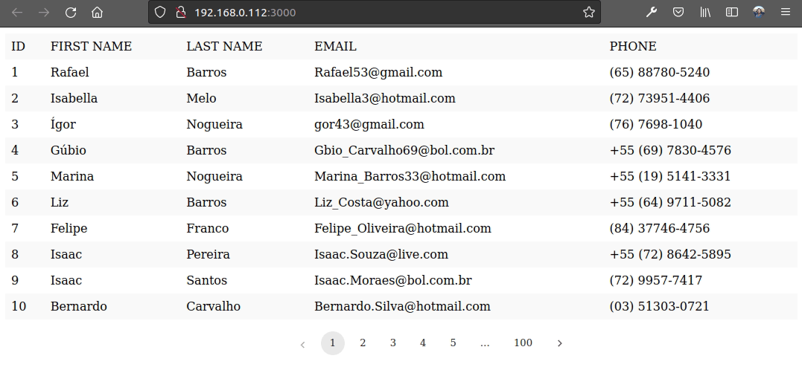
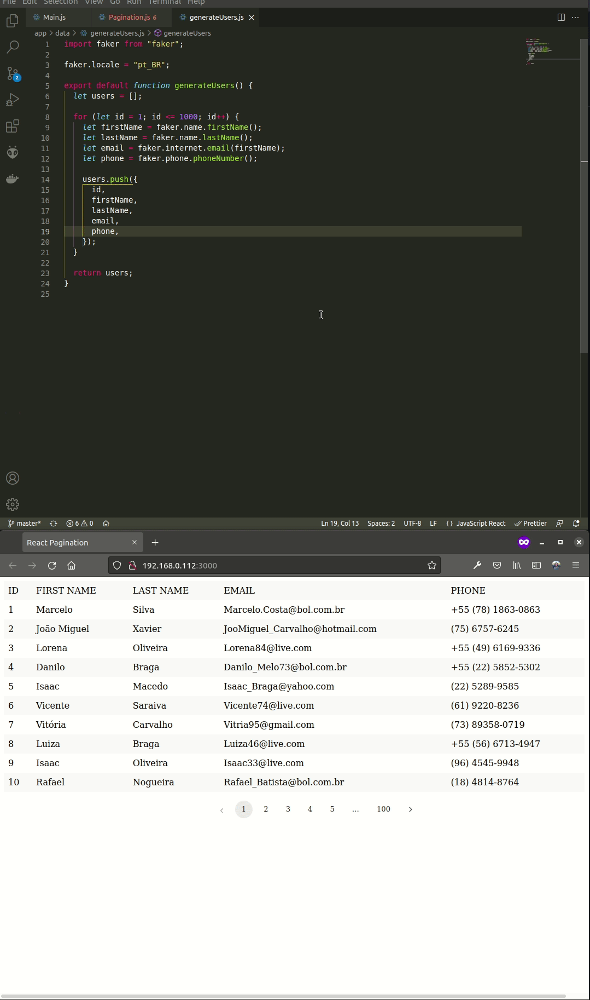

# Custom Pagination Component in React

## Table of Contents

- [Description](#description)
- [React HMR demo](#react-hmr-demo)
- [Setup](#setup)
- [Usage](#usage)
- [Technical info](#technical-info)

  [DevDependencies](#dev-dependencies)

  [Dependencies](#dependencies)

- [Credits](#credits)
- [License](#license)

## Description

This project supports two kinds of APIs

### usePagination

A custom hook that returns you the pagination data which can then be used to create a customized component

### Pagination

A React component that renders the Pagination component and supports previous and next arrow buttons

## React HMR demo

## Setup

Clone this repo to your desktop and run `npm install` to install all the dependencies. **Note**: I like to use the Firefox Development Edition as my default browser. If you need, change the webpack.config.js file to use your preferred browser.

## Usage

Once the dependencies are installed, you can run `npm run dev` to start the application. You will then be able to access it at local-ip:3000 (e.g., http://192.168.0.112:3000).

## Technical info

### DevDependencies

                

### Dependencies

   

## Credits

The original project can be found here: [freeCodeCamp](https://www.freecodecamp.org/news/build-a-custom-pagination-component-in-react/).
